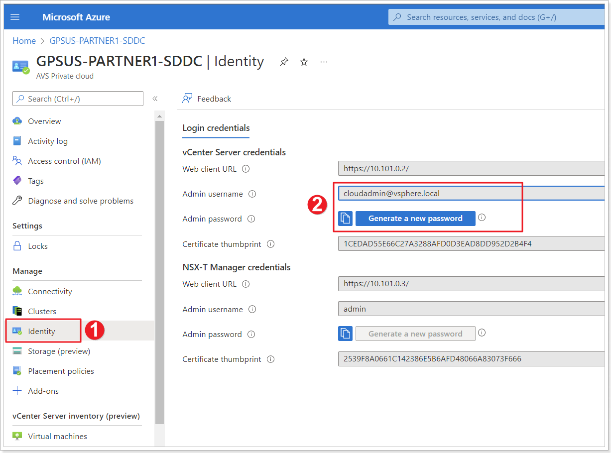
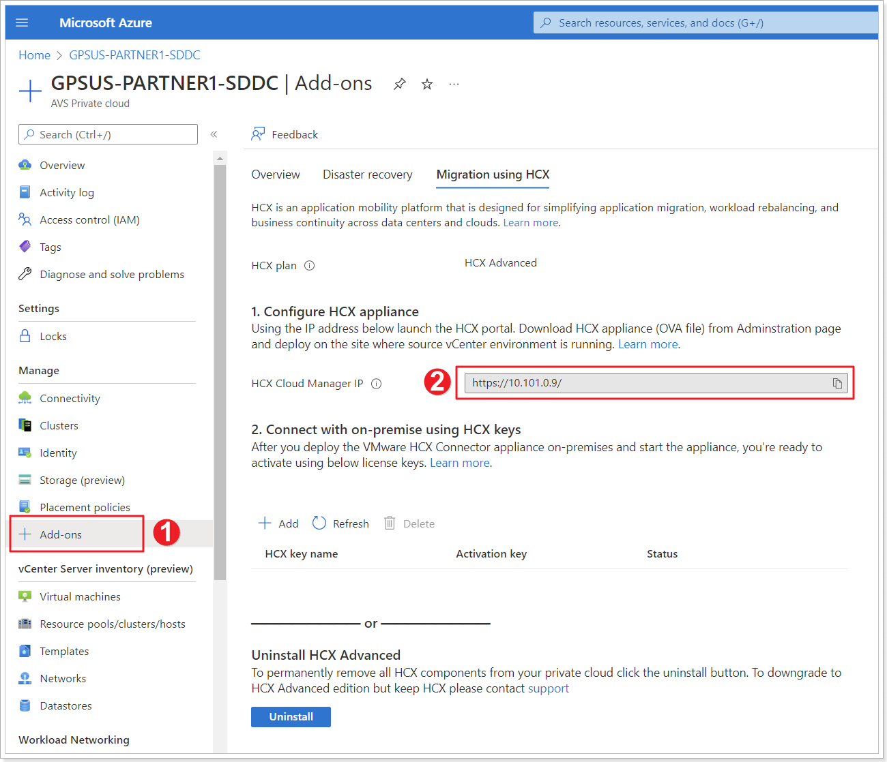
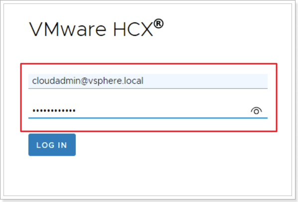
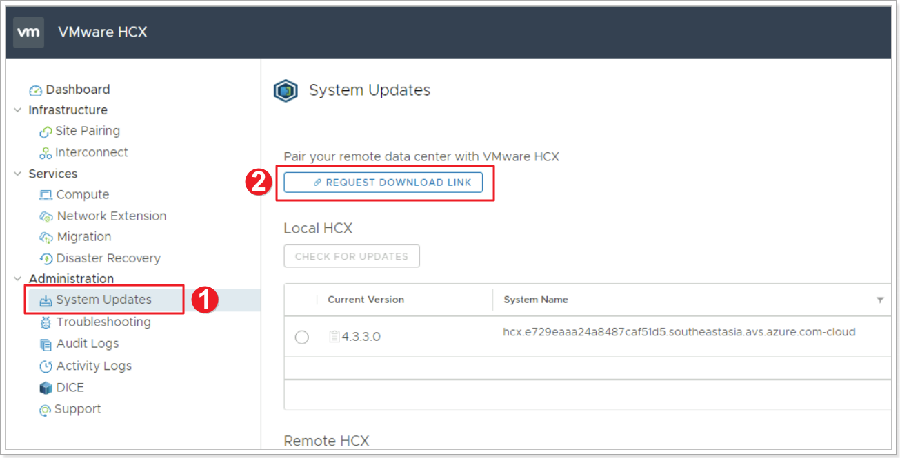
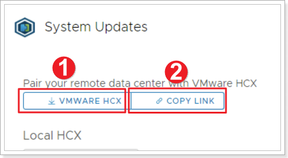
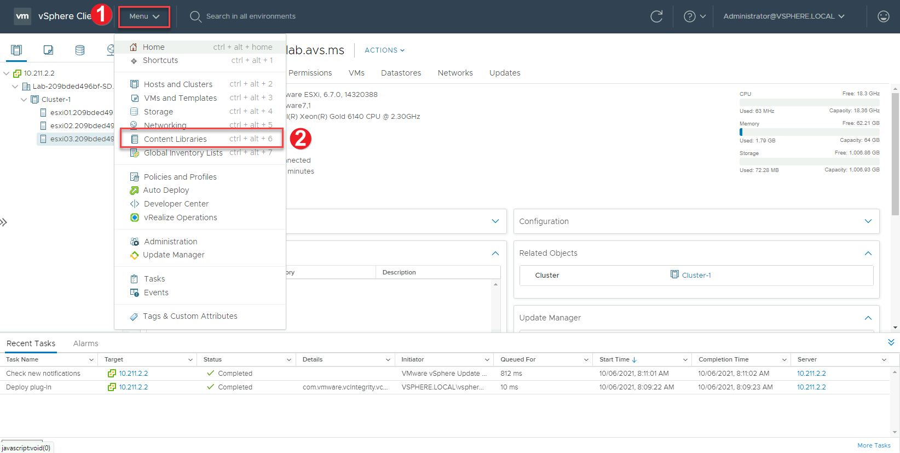

In this step we will import the HCX appliance into the on premises vCenter.

You can choose to do this Task in 2 different ways:

## Option 1: Download and deploy HCX OVA to on-premises vCenter

1. In your AVS Private Cloud blade click **Identity**.
2. Locate and save both vCenter admin username **cloudadmin@vsphere.local** and password.

1. Click on **+ Add-ons**.
2. Copy the **HCX Cloud Manager IP**.

From your Jumpbox, open a browser tab and paste the **HCX Cloud Manager IP** and enter the credentials obtained in the previous step.

1. In the left pane click **System Updates**.
2. Click **REQUEST DOWNLOAD LINK**, please keep in mind that the button might take a couple of minutes to become enabled.

1. Click **VMWARE HCX** to download the HCX OVA to complete this option.
2. You can also click **COPY LINK** if you will install HCX with Option 2.

## Option 2: Deploy HCX from a vCenter Content Library

>**NOTE: An older copy of HCX exists already in the Content Library. Feel free to download and use the newer version through the steps above**

From the Jumpbox, browse to the On-Premises vCenter URL, See [Getting Started](getting-started#on-premises-vmware-lab-environment) section for more information and login details.

1. From your on-premises vCenter click **Menu**.
2. Click **Content Libraries**.

3.  Create a new content library if one doesn’t exist

4.  Once done, select Actions \> Import Item

5.  Enter HCX URL copied from Task 3, Step 6

    

6.  Accept any prompts and actions and proceed. The HCX OVA will download to the
    library in the background

