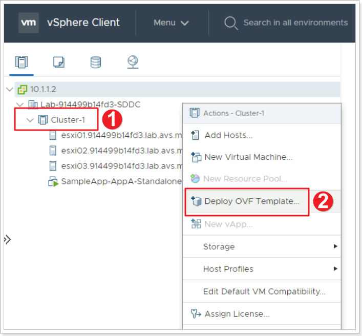
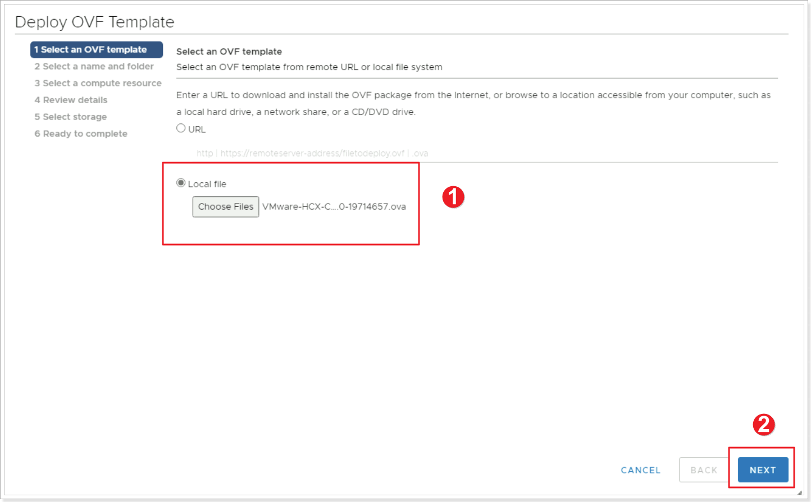
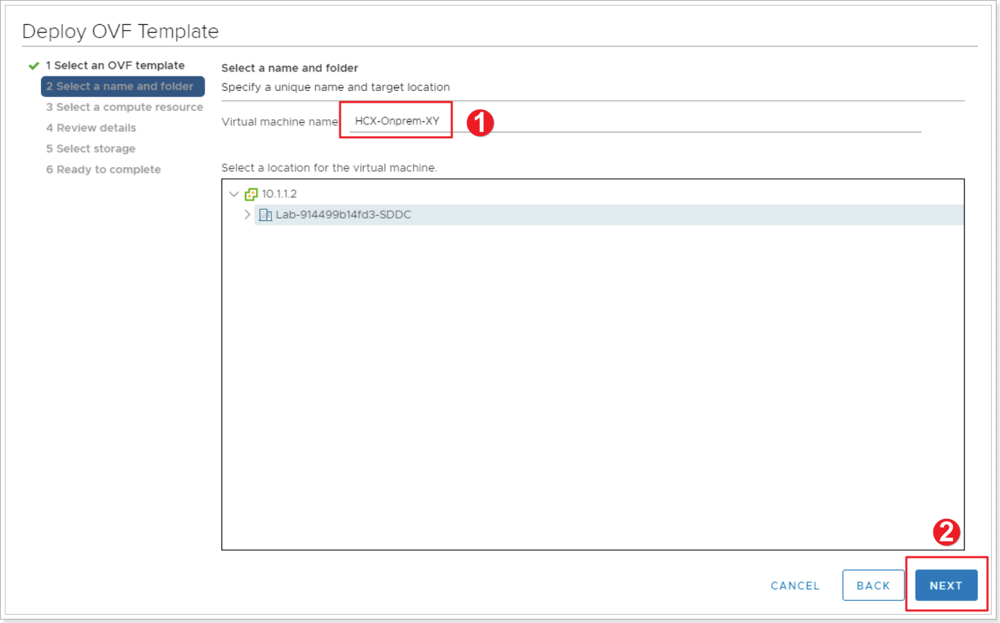
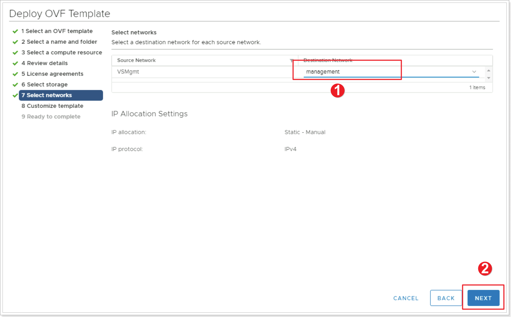
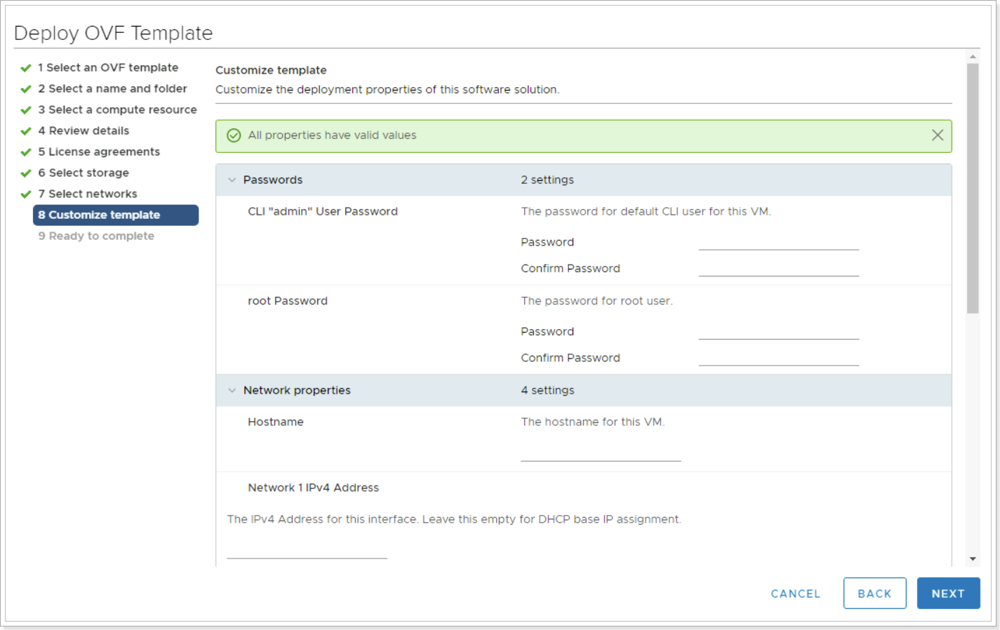
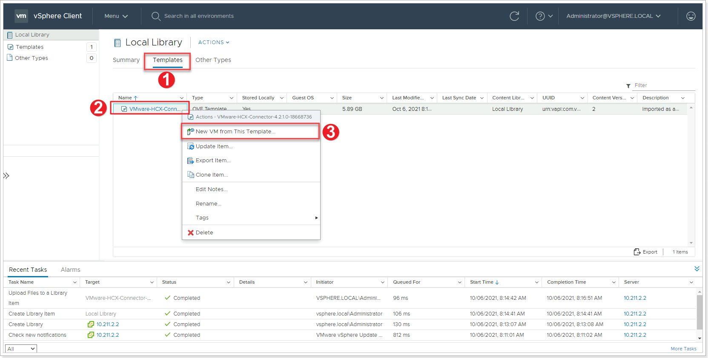
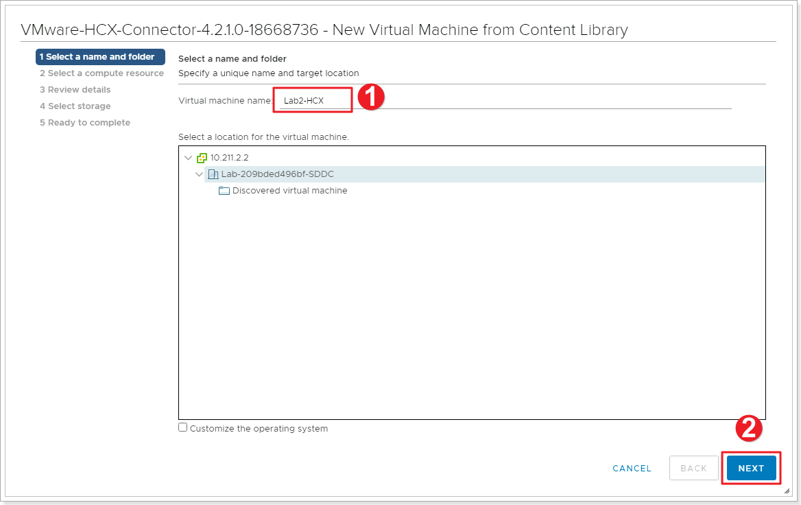
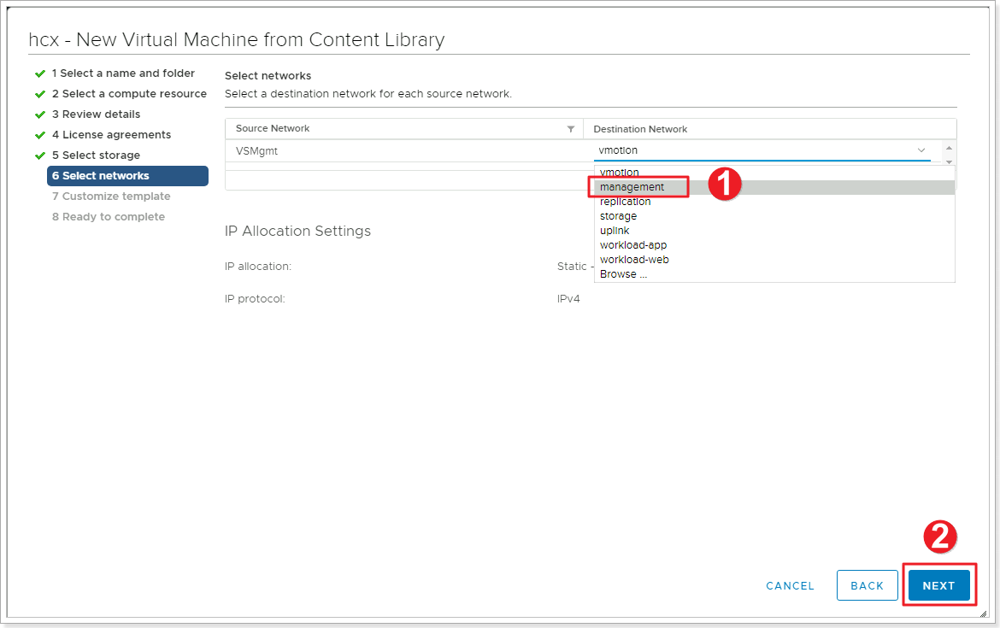
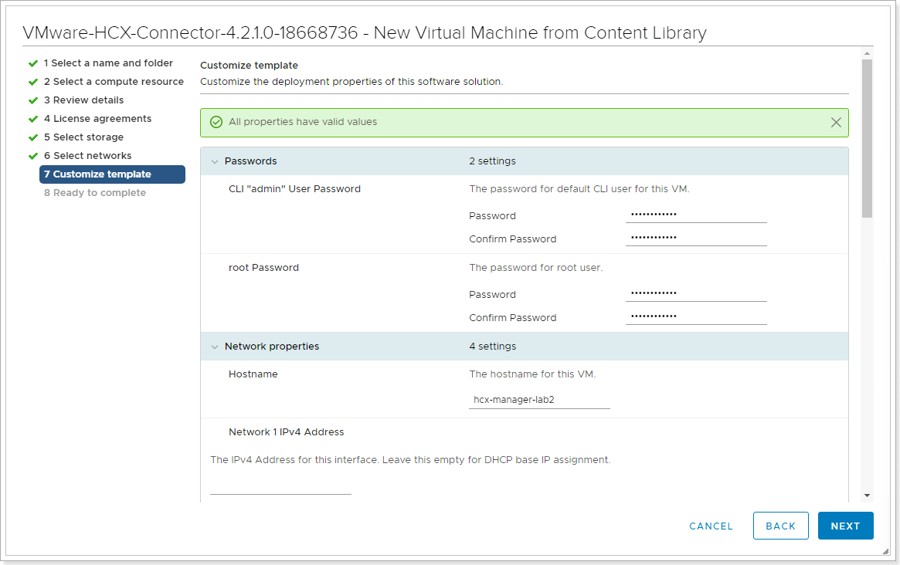

In this step, we will deploy the HCX VM with the configuration from the [Getting Started](getting-started#on-premises-vmware-lab-environment) section.

## Option 1: Deploy OVA from download.

1. Right-click **Cluster-1**.
2. Click **Deploy OVF Template**.

1. Click the button to point to the location of the downloaded OVA for HCX.
2. Click **NEXT**.

1. Give your HCX Connector a name: **HCX-OnPrem-XY**, where X is your group number and Y is your participant number.
2. Click **NEXT**.

Keep the defaults for:
- Compute Resource
- Review details
- License agreements (Accept)
- Storage (LabDatastore)

1. Click to select **management** network.
2. Click **NEXT**.

| **Property**                            | **Value**                                                                                                              |
|-----------------------------------------|------------------------------------------------------------------------------------------------------------------------|
| Hostname                                | Suggestion: HCX-OnPrem-**XY**) **Note: Do not leave a space in the name as this causes the webserver to fail)** |
| CLI "admin" User Password/root Password | 0hDG3VqFyTd!                                                                                                           |
| Network 1 IPv4 Address                  | 10.**X**.**Y**.9                                                                                                         |
| Network 1 IPv4 Prefix Length            | 27                                                                                                                     |
| Default IPv4 Gateway                    | 10.**X**.**Y**.1                                                                                                         |
| DNS Server list                         | 1.1.1.1                                                                                                                |
> Once done, navigate to Menu \> VM’s and Templates \> Power on the newly created HCX Manager VM. The boot process may take 10-15 minutes to complete.

## Option 2: Deploy HCX from Content Library

1.  Once the import is completed from the previous task, click **Templates**.
2. Right Click the imported HCX template.
3. Click **New VM from This Template**.

1. Give your HCX Connector a name: **HCX-OnPrem-XY**, where X is your group number and Y is your participant number.
2. Click **NEXT**.

Keep the defaults for:
- Compute Resource
- Review details
- License agreements (Accept)
- Storage (LabDatastore)

1. Click to select **management** network.
2. Click **NEXT**.

Enter the following details next, Use X as your group number, Y as your participant number.

| **Property**                            | **Value**                                                                                                              |
|-----------------------------------------|------------------------------------------------------------------------------------------------------------------------|
| Hostname                                | Any name (Suggestion: HCX-Manager**XY**) **Note: Do not leave a space in the name as this causes the webserver to fail)** |
| CLI "admin" User Password/root Password | 0hDG3VqFyTd!                                                                                                           |
| Network 1 IPv4 Address                  | 10.**X**.**Y**.9                                                                                                         |
| Network 1 IPv4 Prefix Length            | 27                                                                                                                     |
| Default IPv4 Gateway                    | 10.**X**.**Y**.1                                                                                                         |
| DNS Server list                         | 1.1.1.1                                                                                                                |
> Once done, navigate to Menu \> VM’s and Templates \> Power on the newly created HCX Manager VM. The boot process may take 10-15 minutes to complete.
