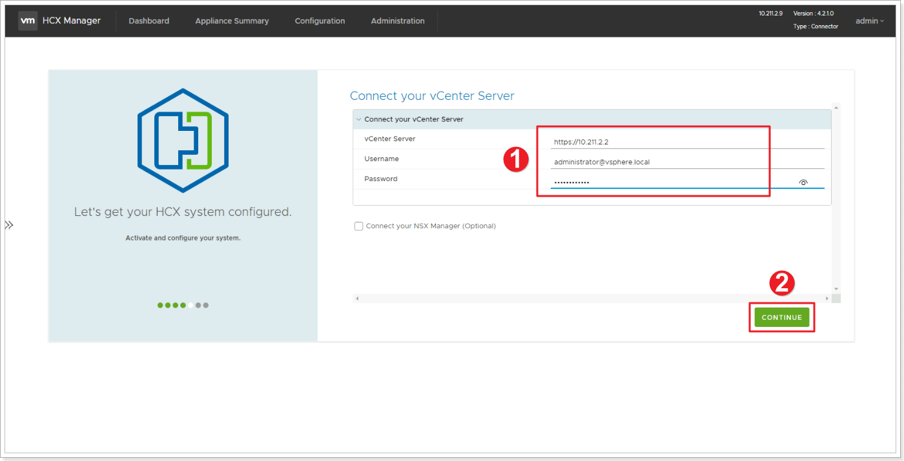
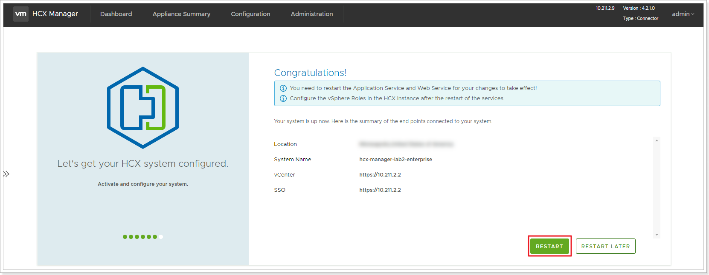
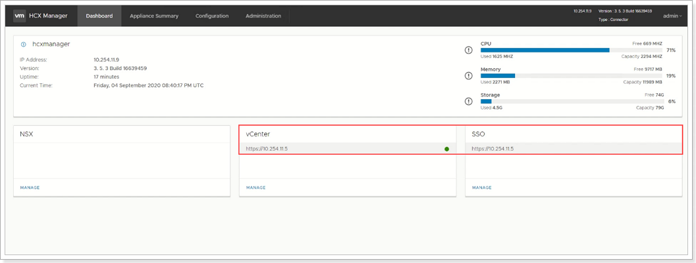

## Configure On-Premises HCX

In this section, we will integrate and configure HCX Manager with the On-Premises vCenter Server.

### **Exercise 1: Complete Configuraiton of On-Premises HCX**

#### Step 1: Connect vCenter Server

1. In **Connect your vCenter**, provide the FQDN or IP address of on-premises vCenter server and the appropriate credentials.
- vCenter IP: <https://10.X.Y.2>
- Username: [administrator@vsphere.local](mailto:administrator@vsphere.local)
- Password: 0hDG3VqFyTd!
2. Click **CONTINUE**.

#### Step 2: Configure SSO/PSC

1. In **Configure SSO/PSC**, provide the same vCenter IP address.
2. Click **CONTINUE**.

#### Step 3: Restart HCX Appliance

Verify that the information entered is correct and select **RESTART**.

The restart may take up to 10 minutes.

After the services restart, you'll see vCenter showing as **Green** on the screen that appears. Both vCenter and SSO must have the appropriate configuration parameters, which should be the same as the previous screen.

> **Note**: It may take an additional 5-10 minutes for the HCX plugins to be installed in vCenter, log back out and log back in if it does not show up automatically.