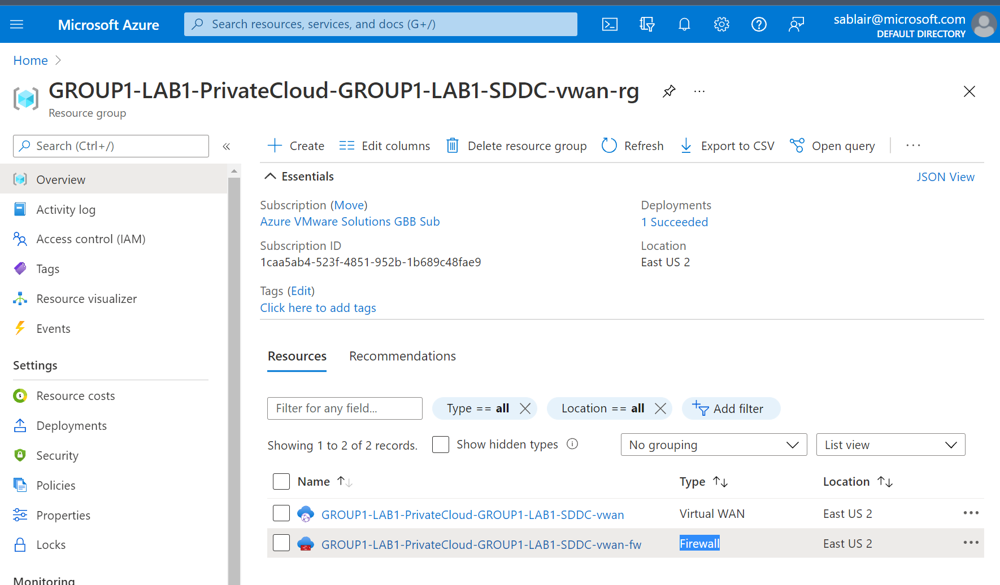
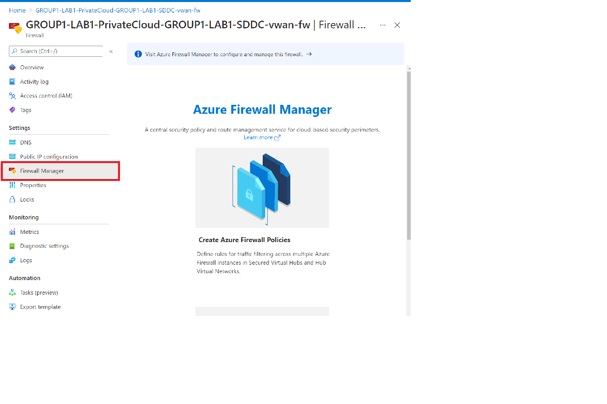
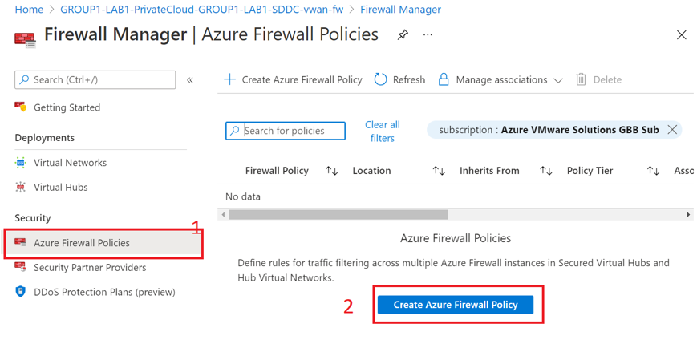
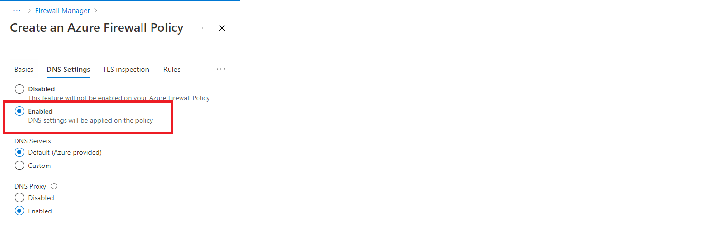
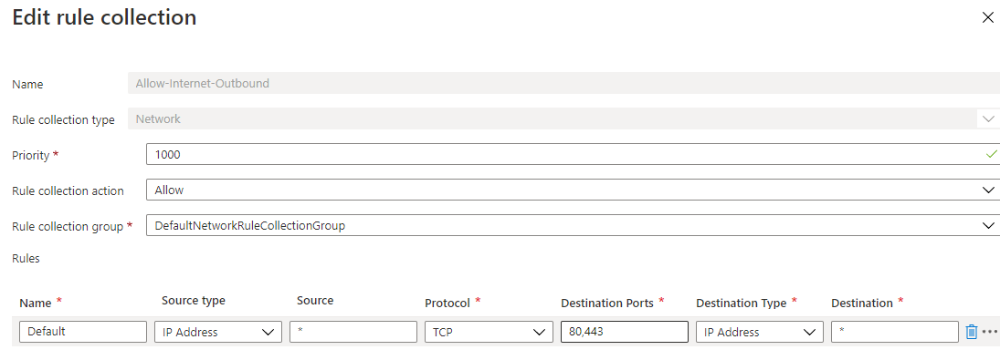

Once Azure vWAN is configured, you will see both Azure Firewall

1.  In the Azure portal, search for and select **Firewall**.

2.  Select a deployed firewall and then select **Visit Azure Firewall Manager to
    configure and manage this firewall**.

    

3.  Select **Azure Firewall Policies** and then select **Create Azure Firewall Policy**.
    

4.  Under the **Basics** tab, provide the required details.

    | Field          | Value                        |
    |----------------|------------------------------|
    | Subscription   | Auto-populated               |
    | Resource Group | Leave default auto-populated |
    | Name           | “Internet Enabled”           |
    | Region         | Pre-Populated                |
    | Policy Tier    | Standard                     |
    | Parent Policy  | None                         |

5.  Select Next: DNS Settings.

6.  Under the **DNS** tab, select **Enable**. For **DNS Servers** Select the
    Default (Azure provided). For the **DNS Proxy** select **Enabled**

    

7.  and then select Next: **Rules**.

4.  Select **Add a rule collection**, provide the below details, and select Add.

    | Field                  | Value                                    |
    |------------------------|------------------------------------------|
    | Name                   | “Internet Outbound Enabled”              |
    | Rule collection type   |  Network                                 |
    | Priority               | Select a numeric value between 100-65000 |
    | Rule collection action | Allow                                    |
    | Rule collection group  | Pre-populated                            |
    | Name of Rule           | Optional                                 |
    | Source Type            | IPaddress                                |
    | Source                 | \*                                       |
    | Protocol               | TCP                                      |
    | Destination port       | 80,443                                   |
    | Destination Type       | IP Address                               |
    | Destination            | \*                                       |

10.  Select Next: **Tags**.

12.  (Optional) Create name and value pairs to categorize your resources.

13.  Select Next: **Review** + **create** and then select **Create**.

Log back into vCenter and retest VM1’s internet connectivity

